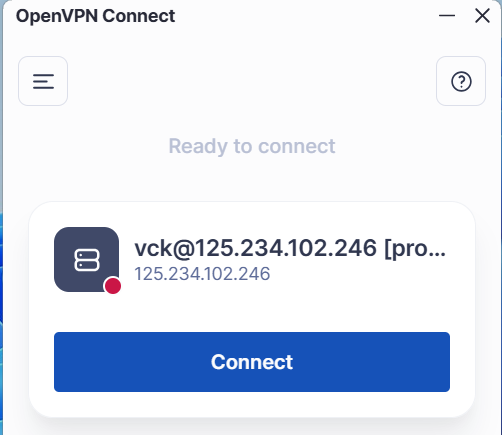

# CÁC PHƯƠNG THỨC XÁC THỰC & BẢO MẬT PHỔ BIẾN
**1. Tạo User và Phương thức xác thực (Authentication)**

- **Local Authentication:** * Tạo và quản lý tài khoản trực tiếp trên database của OpenVPN.

    *Cách dùng*: Phù hợp cho hệ thống nhỏ, ít user hoặc cần cấp quyền truy cập nhanh cho đối tác.

- **RADIUS Authentication:** * Kết nối OpenVPN với một Server RADIUS bên ngoài (như Windows NPS hoặc FreeRADIUS).

    *Cách dùng*: Phù hợp khi doanh nghiệp đã có sẵn hệ thống quản lý tập trung, giúp đồng bộ tài khoản mạng nội bộ với VPN.

- **LDAP/Active Directory:** * Xác thực dựa trên danh bạ người dùng của Windows Server. Người dùng dùng chính tài khoản máy tính văn phòng để đăng nhập VPN.

**2. Chứng thực 2 lớp (Multi-Factor Authentication - MFA)**
Đây là lớp bảo mật bắt buộc để chống lại việc lộ mật khẩu:

- **Cơ chế:** Sau khi nhập đúng mật khẩu (tầng 1), hệ thống yêu cầu mã OTP (tầng 2).

- **Google Authenticator/TOTP:** OpenVPN hỗ trợ sẵn các ứng dụng tạo mã dựa trên thời gian (Time-based OTP).

- **Hardware Token:** Có thể tích hợp với các khóa bảo mật vật lý nếu dùng qua RADIUS proxy.

**3. Hỗ trợ thiết bị (Device Support)**
OpenVPN có khả năng tương thích cực cao, gần như mọi thiết bị đều có thể kết nối:

- **Máy tính**: Windows, macOS, Linux (sử dụng phần mềm OpenVPN Connect hoặc OpenVPN GUI).

- **Di động**: Android, iOS (có ứng dụng chính thức trên Store).

- **Thiết bị mạng**: Router, Firewall khác hoặc các bộ chuyển đổi IoT hỗ trợ Client OpenVPN.

# DEMO (minh họa):
## Với ADMIN https://IP:943/admin
Đăng nhập với quyền quản trị

1. VPN Server 
- Network Settings -> Hostname (or IP address) <- đây là ip WAN hoặc hostname
- Subnets -> Dynamic subnet <- địa chỉ/lớp mạng khi quay vpn thành công sẽ được câp dãy này

2. Authentication
- General Settings -> Default authentication system - chọn Local
- Local tắt mật khẩu khó nếu cần

3. Users
- Thêm mới user và cấu hình căn bản

## Với USER https://IP:943/
1. Đăng nhập với user/pass vừa tạo, tải app về cài đặt

2. Tải về và cài đặt -> Connet

