# Hướng dẫn căn bản

## MÔ HÌNH LAB:
1. Các user không thuộc nhóm nào thì gán ip trong lớp 172.27.0.0/24
2. Các user trong nhóm All Users (mặc định) sẽ gán 192.168.5.0/25 `(2 lớp mạng này độc lập)`
3. User thuộc nhóm IT Group lấy ip 192.168.5.128/26
4. User thuộc nhóm Other Group lấy ip 192.168.5.192/26
5. Mỗi user chỉ có 1 kết nối tại một thời điểm
6. Quản lý truy cập:
- Mọi truy cập bắt buộc phải qua VPN 
- Các nhóm: All Users, Other Group, IT Group truy cập internet **bằng chính IP của client VPN** (là IP khi kết nối VPN thành công) và firewall quản lý truy cập đến đâu
- Các user không thuộc nhóm nào (client thuộc lớp 172.27.0.0/24) truy cập đến internet bằng IP của Open VPN Server


## I. IMPORT OVA
Tải file về -> Open a Virtual Machine -> chọn file OVA -> làm theo gợi ý của VMWare 

## II. CHUẨN BỊ & CẤU HÌNH CĂN BẢN 
- Xác định IP hiện tại 
    - Đăng nhập user/password: **sadmin** / **sadmin**
    - Đổi mật khẩu nếu cần
        ```bash
        sudo passwd sadmin
        ```
    - Xác định IP hiện tại và có thể thay đổi nếu cần:
  
    ```bash
    ip a
    # tìm đến card **ens33**
    ```


    ```bash
    # đổi IP
    sudo nano /etc/netplan/50-cloud-init.yaml
    ```
    ```bash
    # nội dung file .yaml
    network:
      version: 2
      renderer: networkd
      ethernets:
        ens33:
          dhcp4: false
          addresses:
            - 192.168.131.11/24
          routes:
            - to: default
              via: 192.168.131.1
          nameservers:
            addresses:
              - 192.168.99.11
              - 192.168.99.10
    # Lưu file: Nhấn Ctrl + O rồi Enter. -> Nhấn Ctrl + X để thoát  
    ```

    ```bash
    # Apply
    sudo netplan apply
    ```

- **THIẾT LẬP HOST/IP DÙNG ĐỂ KẾT NỐI VPN**
```code
VPN Server -> Network Settings -> Server Address 
```
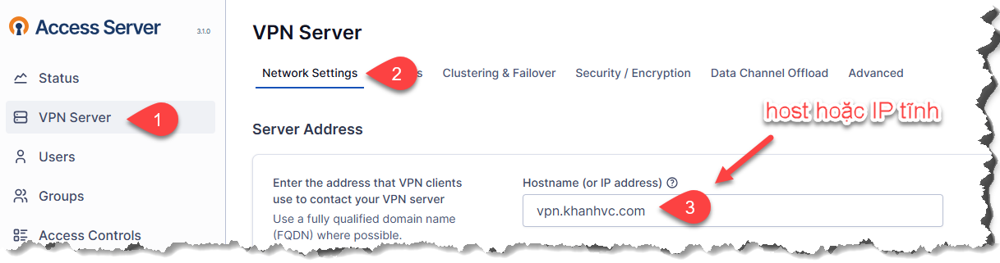

- **Tinh chỉnh bảo mật (nếu cần)**
```code
Authentication > Local
```
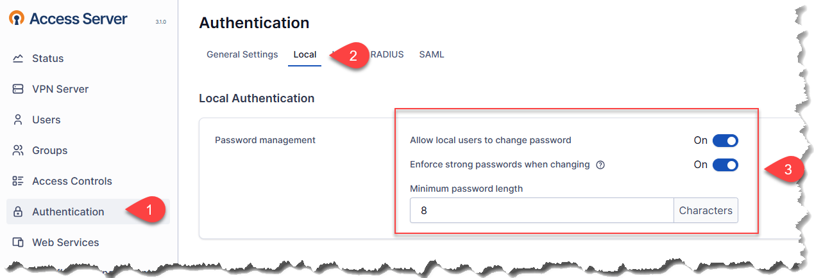


- **Tạo Group**

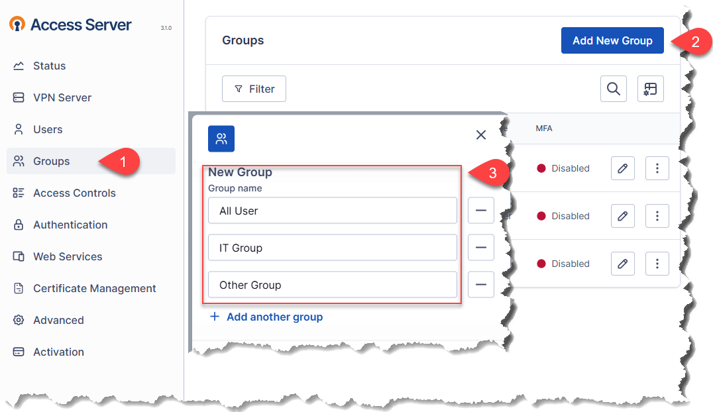

- **Tạo User**

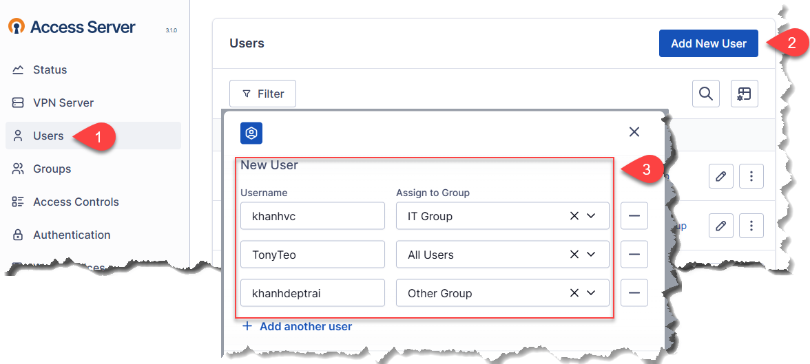

> - Có thể chọn Admin, Allow Auto-login, Require MFA nếu cần
> 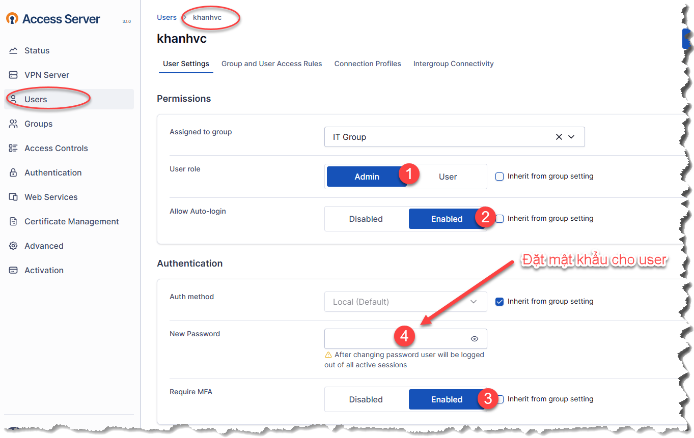

## III. THỰC HIỆN YÊU CẦU

### 1. Các user không thuộc nhóm nào thì gán ip trong lớp 172.27.0.0/24
### 2. Các user trong nhóm All Users (mặc định) sẽ gán 192.168.5.0/25

VPN Server -> Subnets (Dynamic subnet-Áp dụng cho user, Default group subnet áp dụng cho nhóm) -> điền dãy IP muốn cấp nếu quay VPN thành công.

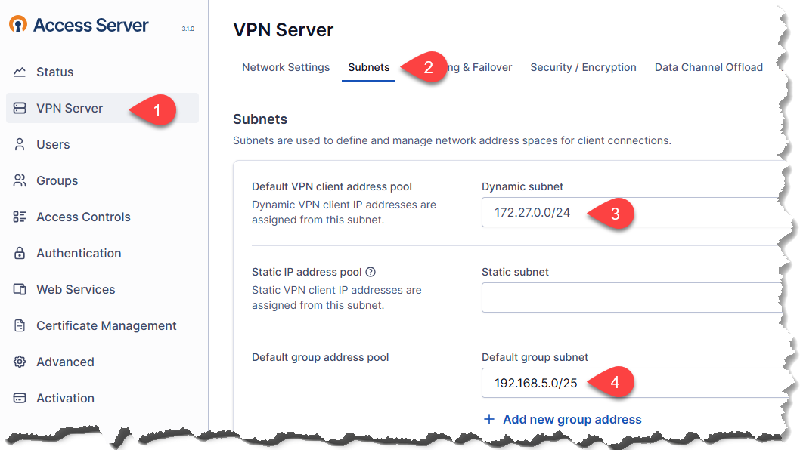

**Thực hiện show route trên OpenVPN AS Server**

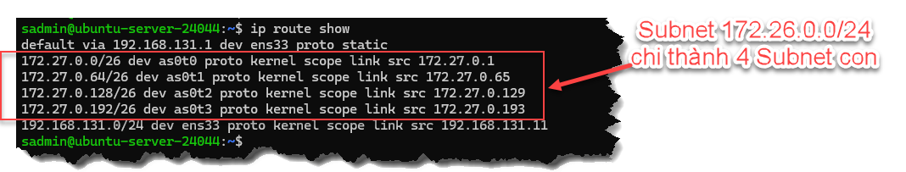

### 2.1 Các user trong nhóm All Users (mặc định)

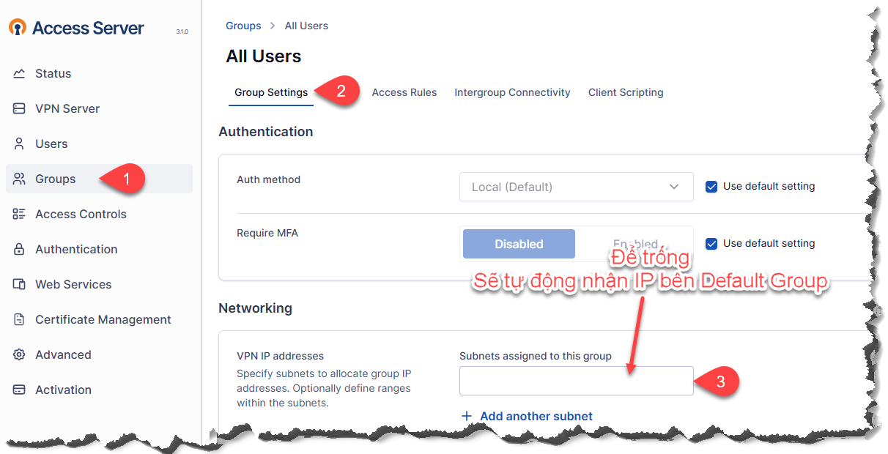

### 3. **User thuộc nhóm IT Group lấy ip 192.168.5.128/26**

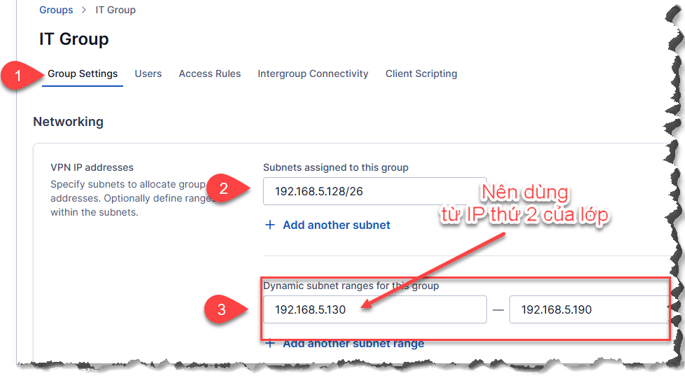

### 4. **User thuộc nhóm Other Group lấy ip 192.168.5.192/26**

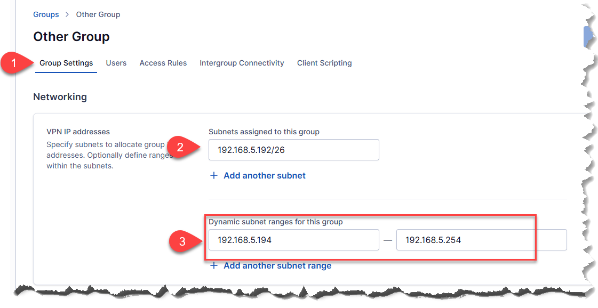

### 5. **Mỗi user chỉ có 1 kết nối tại một thời điểm**

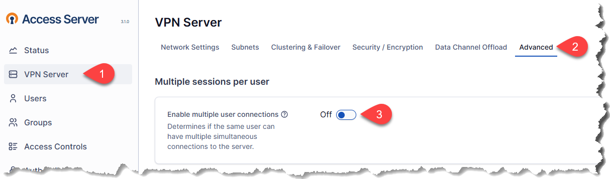

### 6. **Quản lý truy cập:**
- Mọi truy cập bắt buộc phải qua VPN 

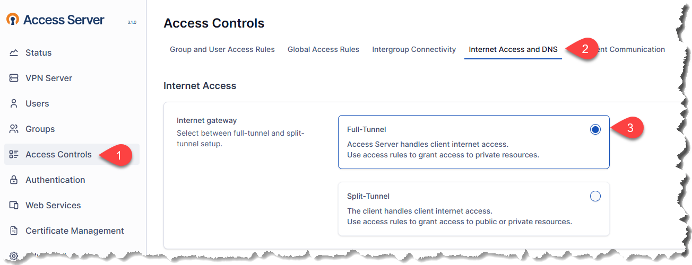

- **Các nhóm**: All Users, Other Group, IT Group truy cập internet **bằng chính IP của client VPN** (là IP khi kết nối VPN thành công) và firewall quản lý truy cập đến đâu:

  - **Kiểm tra bảng route trên Server OpenVPN AS**

    ```bash
    ip route show
    ```

    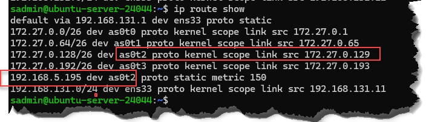

    - Chúng ta thấy mặc định khi các IP client VPN sẽ đi ra ngoài thông qua các interface ảo **as0tX**
    - Cụ thể ví dụ là: **192.168.5.192** thông qua **as0t2**

  - **Kiểm tra bảng NAT**
    ```bash
    sudo iptables -t nat -L -n -v
    ```

      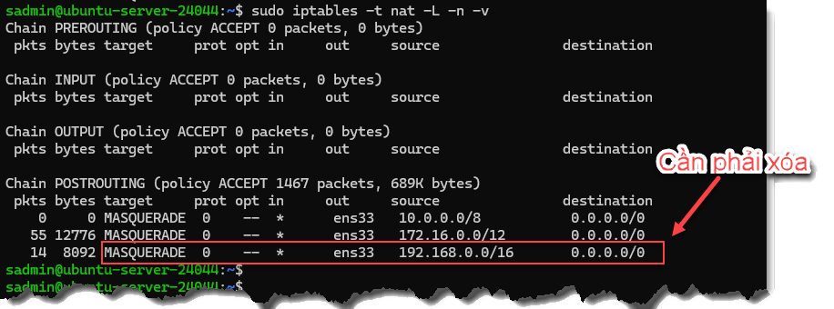

    Phải **xóa dòng NAT** có liên quan đến **192.168.0.0/16** (vì 192.168.5.0/24 là mạng con)

    ```bash
    sudo iptables -t nat -D POSTROUTING -s 192.168.0.0/16 -o ens33 -j MASQUERADE
    ```

    **Lưu cấu hình**
    ```bash
    sudo netfilter-persistent save

    # nếu lỗi phải cài gói
    sudo apt install iptables-persistent -y
    ```

- **Các user không thuộc nhóm nào (client thuộc lớp 172.27.0.0/24) truy cập đến internet bằng IP của Open VPN Server**

  `Tương tự `kiểm tra bảng NAT, **thêm lớp mạng 172.27.0.0/24** nếu không có trong bảng NAT (vì nhóm này đi ra ngoài mạng bằng chính IP của OpenVPN AS server)

  ```bash
  iptables -t nat -A POSTROUTING -s 172.27.0.0/24 -o ens33 -j MASQUERADE
  ```
> NOTED:
>   - Để biết client VPN đi ra ngoài có NAT hay không thì phải `tcpdump` (xem trong phần t-shoot) 
>   - Ví dụ: ` sudo tcpdump -i any src 192.168.5.197 and dst 1.1.1.1 `

## III. TRIỂN KHAI CHO CLIENT
### 1. Đăng nhập với IP/Password vừa tạo trên
```bash
https://<IP>:943
```
### 2. DEBUG (nếu quay VPN không thành công)
- Trên Server OpenVPN AS

  - **List** các port OpenVPN đang lắng nghe
    ```bash
    sudo netstat -tulpn | grep openvpn
    ```
  
  - **Thêm** các port vào firewall của ubuntu nếu chưa có
    ```bash
    # ví dụ, thực tế có bao nhiêu port thì thêm bấy nhiêu
    sudo ufw allow 914:917/tcp
    sudo ufw allow 914:917/udp

    # Kiểm tra các rule trong fileware
    sudo ufw status
    ```

    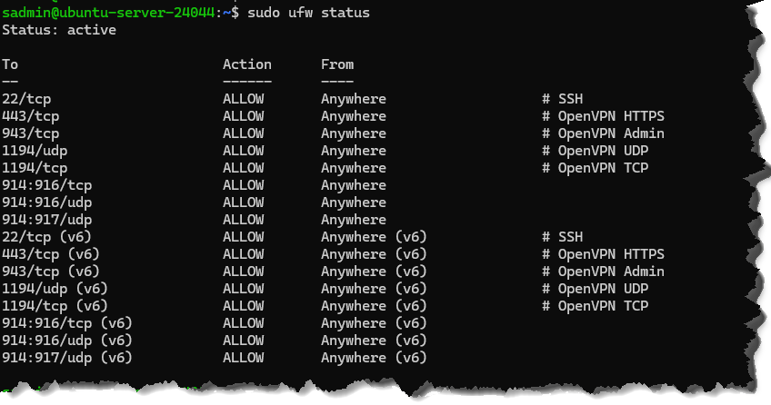

  - **HOẶC** tắt firewall để test
    ```bash
    sudo ufw disable
    sudo ufw reload
    sudo systemctl restart openvpnas
    ```

> *NOTED:* 
> - Phải NAT in/Port Forwarding trên firewall trỏ về OpenVPN các port: 
>    - UDP: 1194
>    - TCP: 443
>    - TCP: 943
> - Nếu đã thiết lập VPN thành công thì OK, tuy nhiên sẽ không truy cập được gì cả.
> - Làm tiếp các bước dưới


  - **Nếu kết nối không thì phải Debug**
    ```bash
    sudo tcpdump -i any port 1194
    ```

## IV. KIỂM TRA KẾT NỐI TỪ CLIENT VPN ĐẾN LAN/SERVER
### - Cấu hình routing:
- Core:
    - Hướng đến Client VPN (Ví dụ trên là: 192.168.5.0/24) về Firewall
- Firewall:
    - Hướng đến 192.168.5.0/24 là về IP của OpenVPN
- OpenVPN:
    - Không cần route ngược vì mặt định đã ép Client VPN đi qua tunnel rồi.

### - Cấu hình Rule/Policies trên Firewall:
- **WAN-to-LAN**: NAT port UDP 1194, TCP: 443, 943 
- Allow **LAN-to-DMZ** và ngược lại (không cần NAT)
- Allow **VPN Client-to-Internet**/WAN, bắt buộc **bật NAT**


### - Cấu hình Access Controls trên OpenVPN:
- **0.0.0.0/0** cho nhóm tương ứng, via **Route**

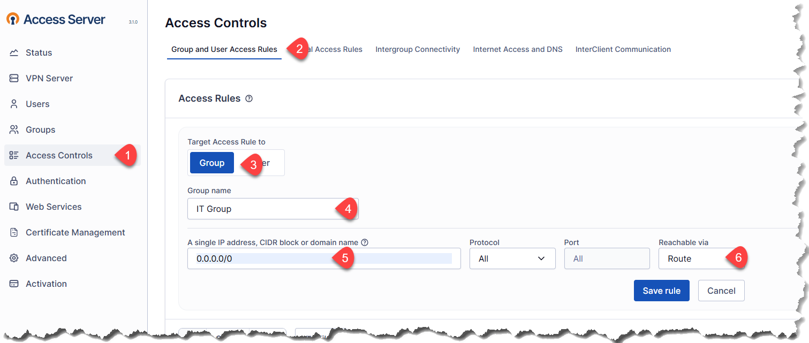