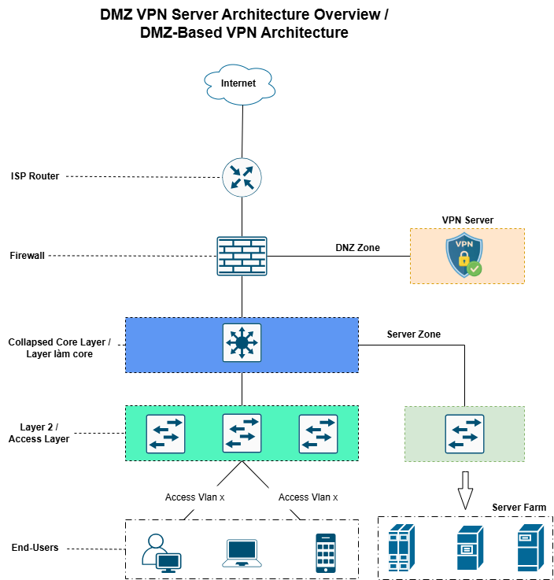

# TRIỂN KHAI VPN CLIENT-TO-SITE
**VPN Client-to-Site** là giải pháp cho phép người dùng từ xa kết nối an toàn vào mạng nội bộ công ty thông qua phần mềm VPN trên máy cá nhân và đường truyền Internet.

## 1. Khi nào dùng giải pháp này
Sử dụng khi nhân viên cần làm việc từ xa (Remote work), công tác hoặc truy cập tài nguyên nội bộ (File server, ERP) một cách bảo mật qua môi trường Internet công cộng.

## 2. Vị trí đặt VPN Server
- **Tại Firewall (DMZ Zone - `KHUYẾN NGHỊ`):** 
    - Tạo lớp bảo vệ trung gian giữa Internet và mạng nội bộ.

    - Firewall kiểm soát chặt chẽ luồng dữ liệu, giới hạn quyền truy cập vào các VLAN cần thiết.

    - Tách biệt lưu lượng người dùng bên ngoài và tài nguyên hệ thống, giảm thiểu rủi ro lan truyền mã độc

- **Tại Core Layer 3 Switch (Server Zone - `Không` khuyến nghị):**
    - Lưu lượng Internet đi trực tiếp vào "trái tim" của hệ thống mạng.

    - Thiếu các tính năng bảo mật chuyên sâu (DPI, IPS) của Firewall chuyên dụng.

    - Chiếm dụng tài nguyên xử lý của Core Switch, ảnh hưởng đến hiệu năng định tuyến nội bộ.

## Sơ đồ tổng quan
