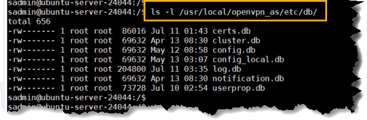

# SAO LƯU & PHỤC HỒI

## 1. Backup

### Mục tiêu:
Backup các file dữ liệu nén lại lưu vào `"/root/backups"` và ghi log

- Kiểm tra tồn tại các file dữ liệu

```bash
ls -l /usr/local/openvpn_as/etc/db/
```


> Chú ý: 
> - `userprop.db`: Nắm giữ toàn bộ tài khoản người dùng, phân quyền, và đặc biệt là các khóa bí mật MFA (Multi-Factor Authentication) của từng user. Nếu mất file này, mọi user sẽ phải quét lại mã QR Google Authenticator từ đầu.

> - `certs.db`: Chứa toàn bộ hạ tầng khóa công khai (PKI), bao gồm chứng chỉ bảo mật của server và của tất cả các client đang kết nối.

> - `config.db` & `config_local.db`: Lưu trữ mọi thiết lập trên giao diện web Admin (cổng kết nối, cấu hình routing, subnet cấp phát, v.v.).


- Kiểm tra để xác nhận đúng dữ liệu mình cần không

```bash
sudo /usr/local/openvpn_as/scripts/sacli UserPropGet

```

- Soạn file `backup_openvpn_as.sh`

```bash
#!/usr/bin/env bash
#
# backup_openvpn_as.sh
# Backup thư mục database của OpenVPN Access Server.
# Quy trình: stop service -> backup -> start service -> nén -> log
#
# Cách dùng:
#   sudo ./backup_openvpn_as.sh
#
# Có thể đặt lịch chạy tự động bằng cron, ví dụ backup mỗi ngày lúc 2h sáng:
#   0 2 * * * /root/backup_openvpn_as.sh >> /var/log/openvpn_as_backup_cron.log 2>&1

set -uo pipefail

# ==== Cấu hình ====
DB_DIR="/usr/local/openvpn_as/etc/db"
BACKUP_DIR="/root/backups"
LOG_FILE="/var/log/openvpn_as_backup.log"
SERVICE_NAME="openvpnas"
TIMESTAMP="$(date +%Y%m%d_%H%M%S)"
ARCHIVE_NAME="OpenVPN_AS_${TIMESTAMP}.tar.gz"
ARCHIVE_PATH="${BACKUP_DIR}/${ARCHIVE_NAME}"
TMP_STAGE_DIR="$(mktemp -d /tmp/openvpn_as_backup.XXXXXX)"

# ==== Hàm ghi log ====
log() {
    local level="$1"
    shift
    local msg="$*"
    echo "$(date '+%Y-%m-%d %H:%M:%S') [${level}] ${msg}" | tee -a "$LOG_FILE"
}

# ==== Hàm dọn dẹp khi thoát (dù thành công hay lỗi) ====
cleanup() {
    if [[ -d "$TMP_STAGE_DIR" ]]; then
        rm -rf "$TMP_STAGE_DIR"
    fi
}
trap cleanup EXIT

# ==== Kiểm tra quyền root ====
if [[ "$(id -u)" -ne 0 ]]; then
    echo "Script này cần chạy với quyền root (sudo)." >&2
    exit 1
fi

# ==== Kiểm tra thư mục cần thiết ====
mkdir -p "$BACKUP_DIR"
touch "$LOG_FILE" 2>/dev/null || LOG_FILE="/root/backups/openvpn_as_backup.log"

log "INFO" "===== Bắt đầu quá trình backup OpenVPN AS ====="

if [[ ! -d "$DB_DIR" ]]; then
    log "ERROR" "Không tìm thấy thư mục dữ liệu: ${DB_DIR}. Dừng script."
    exit 1
fi

# ==== Bước 1: Dừng dịch vụ OpenVPN AS ====
log "INFO" "Đang dừng dịch vụ ${SERVICE_NAME}..."
if systemctl stop "$SERVICE_NAME"; then
    log "INFO" "Dừng dịch vụ ${SERVICE_NAME} thành công."
else
    log "ERROR" "Dừng dịch vụ ${SERVICE_NAME} thất bại. Dừng script, không tiến hành backup."
    exit 1
fi

# ==== Bước 2: Backup dữ liệu (copy sang thư mục tạm trước khi nén) ====
log "INFO" "Đang sao chép dữ liệu từ ${DB_DIR} ..."
if cp -a "$DB_DIR" "$TMP_STAGE_DIR/db"; then
    log "INFO" "Sao chép dữ liệu thành công vào thư mục tạm."
    BACKUP_OK=1
else
    log "ERROR" "Sao chép dữ liệu thất bại."
    BACKUP_OK=0
fi

# ==== Bước 3: Khởi động lại dịch vụ OpenVPN AS (luôn thực hiện, kể cả khi backup lỗi) ====
log "INFO" "Đang khởi động lại dịch vụ ${SERVICE_NAME}..."
if systemctl start "$SERVICE_NAME"; then
    log "INFO" "Khởi động dịch vụ ${SERVICE_NAME} thành công."
else
    log "ERROR" "Khởi động dịch vụ ${SERVICE_NAME} thất bại! Cần kiểm tra thủ công ngay."
fi

# Nếu bước backup lỗi thì dừng tại đây (đã khởi động lại service ở trên)
if [[ "$BACKUP_OK" -ne 1 ]]; then
    log "ERROR" "Backup thất bại, không tạo file nén. Kết thúc script với lỗi."
    exit 1
fi

# ==== Bước 4: Nén dữ liệu và lưu với tên có timestamp ====
log "INFO" "Đang nén dữ liệu thành ${ARCHIVE_PATH} ..."
if tar -czf "$ARCHIVE_PATH" -C "$TMP_STAGE_DIR" db; then
    ARCHIVE_SIZE="$(du -h "$ARCHIVE_PATH" | cut -f1)"
    log "INFO" "Nén thành công: ${ARCHIVE_PATH} (kích thước: ${ARCHIVE_SIZE})"
else
    log "ERROR" "Nén dữ liệu thất bại."
    exit 1
fi

log "INFO" "===== Hoàn tất quá trình backup OpenVPN AS ====="
exit 0
```

- Cấp quyền thực thi cho file

```bash
sudo chmod +x /root/backup_openvpn_as.sh

```

- Thực hiện

```bash
sudo  /root/backup_openvpn_as.sh

```

## 2. Restore

- Cài đặt lại OpenVPN trắng/mới
- Stop Sevices OpenVPN

```bash
sudo systemctl stop openvpnas
```

- Xóa hoặc backup đổi tên thư mục `/usr/local/openvpn_as/etc/db/` mới cài.
- Giải nén file backup đè vào đúng vị trí `/db`

```bash
sudo tar -xzvf openvpn_backup_2026xxxx.tar.gz -C /
```

- Khởi động lại service OpenVPN
```bash
sudo systemctl restart openvpn-server@server
# hoặc sudo systemctl restart openvpn
```
