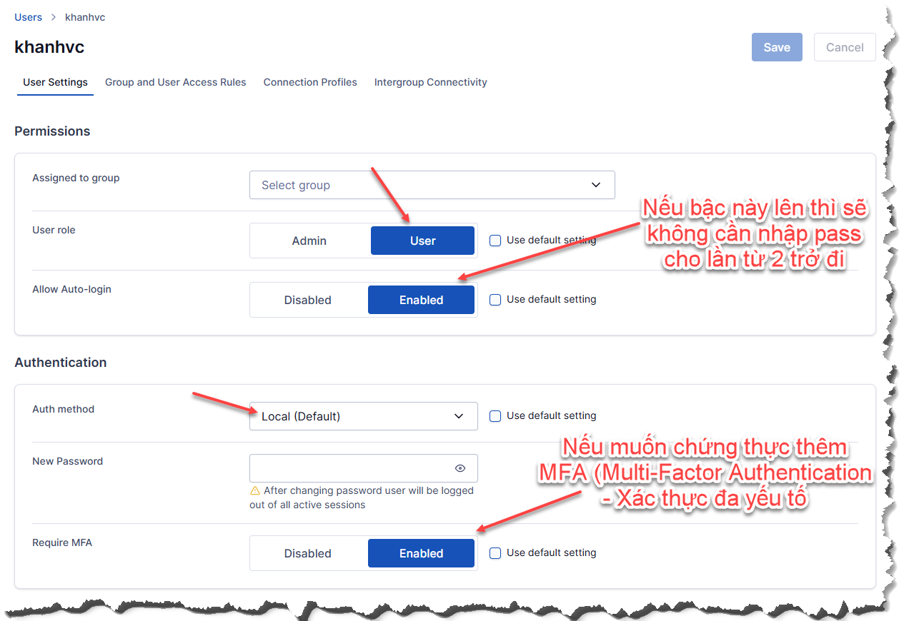
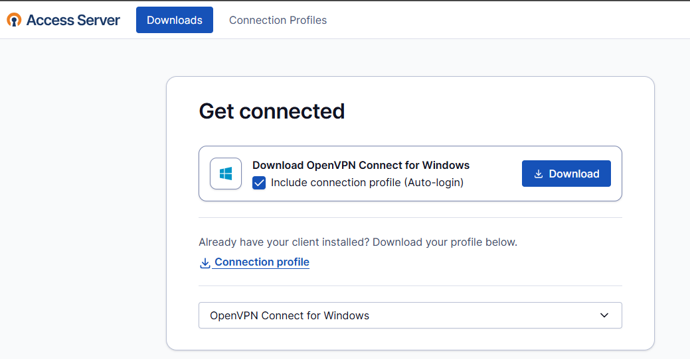

# Trên ADMIN https://IP:943/admin
## VPN Server 
- Network Settings -> Hostname (or IP address) <- đây là ip WAN hoặc hostname
- Subnets -> Dynamic subnet <- địa chỉ/lớp mạng khi quay vpn thành công sẽ được câp dãy này

## Authentication
- General Settings -> Default authentication system - chọn Local
- Local tắt mật khẩu khó nếu cần

## Users
- Thêm mới user và cấu hình căn bản

# Trên USER https://IP:943/
## Đăng nhập với user/pass vừa tạo, tải app về cài đặt

